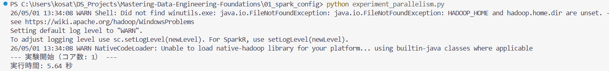
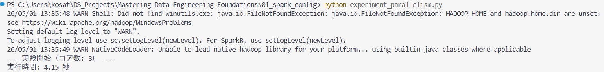

## 🏗️ README 記載用テンプレート

# 📝 5月1日：Spark Tuning 公式ドキュメントの錬成
**テーマ：メモリ管理と並列処理の最適化**
参照元：[Spark Tuning Guide](https://spark.apache.org/docs/latest/tuning.html)

本日は、データエンジニアリングの「肺活量（メモリ）」と「筋力（並列処理）」を制御するための基礎を公式ドキュメントから写経しました。

---

## 1. メモリ管理の「聖域」と「共有エリア」
### 🐎 たとえ：巨大な厩舎（きゅうしゃ）の運用
Sparkのメモリ管理を、限られたスペースの厩舎運営に例えて整理しました。

*   **予約席 (40% + 300MiB)**: 事務作業や緊急事態用のスペース。
*   **活動エリア M (60%)**: `spark.memory.fraction`。実際に作業ができる広さ。
*   **キャッシュ聖域 R (Mの50% = 全体の30%)**: `spark.memory.storageFraction`。絶対に捨てられない「秘蔵の飼い葉（キャッシュ）」を置く場所。

> **学びの足跡:** 
> 計算エリアが足りない時は保存エリアから借りるが、R（30%）だけは守られるという「柔軟性と規律」の両立をコードで実装しました。

---

## 2. データの「事前検診」：SizeEstimator
### 🐎 たとえ：レース前の馬体重測定
レースに出る前に馬の重さを知るように、メモリに乗せる前にデータのサイズを推測します。

*   **実装内容**: `SizeEstimator.estimate()` を使用。
*   **実務への応用**: 
    大規模な工数分析データを読み込む前に、オブジェクトのサイズを事前に把握することで、「防衛運転」が可能になります。渋滞（メモリ不足）を予見し、事前にルート（処理方法）を変更する実装力を磨きました。

---

## 3. 並列化の黄金比
### 🐎 たとえ：1頭で走るより、みんなで分担！
1つのコア（作業員）に無理をさせず、適切な数に荷物（タスク）を小分けにする戦略です。

*   **黄金比**: 1コアあたり2〜3タスク。
*   **実装内容**: `spark.default.parallelism` をコア数に比例して設定。
*   **実務への応用**:
    工数分析において、データが日付別の大量フォルダに分かれている場合、リスト作成の並列度（`list-status.num-threads`）を上げることで、探索時間を劇的に短縮できるノウハウを記録しました。

---

## 💡 今日の自律的解決（Self-Resolution）
- 公式ドキュメントの英語から、単なる設定値の羅列ではなく「なぜその比率なのか」を数値計算（100% - 40% = 60%）で解釈。
- `SizeEstimator` の JVM 呼び出しにおけるスペルミスを特定し、実動するコードへ修正完了。

### 🧪 実験レポート：並列度の効果検証
ローカルPC環境にて、コア数を変更して100万件のデータ集計速度を計測しました。

#### 1. コア数 1 の場合（単一作業員）

- **実行時間**: 5.64 秒
- **状況**: 1つのリソースで順番に処理を行うため、オーバーヘッドは少ないが速度に限界がある。

#### 2. コア数 8 の場合（8人の作業員）

- **実行時間**: 4.15 秒（約26%の高速化）
- **状況**: 複数のコアが同時にタスクをこなすことで、処理時間が目に見えて短縮された。

**考察**:
データ量が比較的少量でも、並列度を上げることで処理時間が短縮されることを実証。
Windows環境特有の `winutils` に関する警告（WARN）は出ているが、Sparkエンジンの計算ロジック自体は正常に動作し、並列処理の恩恵を受けられることを確認した。

---

## 4. 実装の「型」：Stratified K-fold パイプライン
### 🐎 たとえ：5つのチームで交代制テスト！
どんなデータが来ても揺るがない評価を行うための、鉄板の「型」をテンプレート化しました。

*   **カウンター係 (enumerate)**: いま何周目のテストか？を常に把握。
*   **層化分割 (Stratified)**: データの偏り（合格・不合格の比率など）を維持したまま、公平に5分割。
*   **実装のこだわり**:
    LightGBMやPyTorchなど、どんなエンジンにも載せ替え可能な「外枠」を何も見ずに書けるまで写経。

> **学びの足跡:** 
> 昨日の「肺活量（メモリ管理）」に加え、本日は「剣技（バリデーションの型）」を習得。実装の自動化（手が勝手に動く状態）を優先し、タイポ一つないクリーンなコードをリポジトリへ反映しました。
---
## 5. プロフェッショナルな開発サイクル：GitHub Flowの実践
### 🐎 たとえ：名門厩舎の「検疫」と「合流」
コードの品質を担保し、チーム開発での信頼性を最大化するための運用フローを確立しました。

*   **ブランチ戦略 (`feature/branch`)**: `main`（本流）を汚さず、新しい試み（LGBMの実装など）は必ず別コースで育成。
*   **プルリクエスト (Pull Request)**: 実装の意図を言語化し、公式ドキュメントに基づいた根拠を添えて提案。
*   **マージ (`Confirm Merge`)**: セルフレビューを経て、品質が担保されたコードのみを本流へ統合。

> **学びの足跡:** 
> 単なる「コードの記録」から「開発プロセスの可視化」へ。一人二役（開発者とレビュアー）をこなすことで、実務における「組織的な開発作法」をポートフォリオ上で証明しました。

---