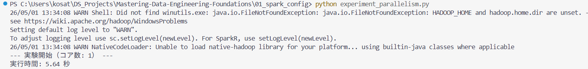
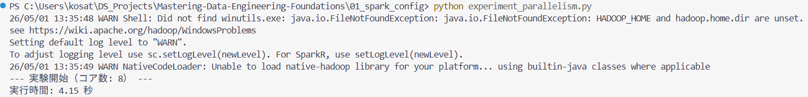

# Mastering Data Engineering Foundations
## 📝 最終更新：2026年5月16日（実装編：クラウドパイプラインと最適化の型）

本リポジトリは、データエンジニアリングの公式ドキュメント（Spark等）の深い理解と、実務で通用する「実装の型」を磨き上げるためのナレッジベースです。単なるコードの写経に留まらず、理論的な根拠と実務への応用可能性を重視しています。

---

## 1. Spark Tuning：メモリ管理の「聖域」と「共有エリア」
### 🐎 たとえ：巨大な厩舎（きゅうしゃ）の運用
[Spark Tuning Guide](https://spark.apache.org/docs/latest/tuning.html)に基づき、限られた計算リソースを最適化する戦略を整理しました。

* **予約席 (40% + 300MiB)**: システム維持・緊急時用のバッファ。
* **活動エリア M (60%)**: `spark.memory.fraction`。実際にタスクが動く広さ。
* **キャッシュ聖域 R (Mの50% = 全体の30%)**: `spark.memory.storageFraction`。再利用するデータを保護する領域。

> **学びの足跡:** > 計算エリアが足りない時は保存エリアから借りるが、最低限のR（30%）だけは死守されるという「柔軟性と規律」の設計思想をコードに反映しました。

---

## 2. データの「事前検診」：SizeEstimator
### 🐎 たとえ：レース前の馬体重測定
メモリ破綻（OOM）を防ぐため、実行前にオブジェクトサイズを推測する「防衛運転」の実装です。

* **実装内容**: `SizeEstimator.estimate()` を活用。
* **実務への応用**: 
  大規模な工数分析データを読み込む前にサイズを把握し、事前に処理ルート（パーティション数等）を動的に変更するロジックの基礎を磨きました。

---

## 3. 並列化の黄金比
### 🐎 たとえ：1頭で走るより、みんなで分担！
1つのコア（作業員）に無理をさせず、タスクを最適に分散させる戦略です。

* **黄金比**: 1コアあたり2〜3タスクの割り当て。
* **実装内容**: `spark.default.parallelism` をコア数に比例設定。
* **実務への応用**: 日付別フォルダに分散したデータの探索時間を、並列スレッド調整により劇的に短縮する手法を記録。

### 🧪 実験レポート：並列度の効果検証
100万件のデータ集計において、並列処理の効果を実証しました。

| 設定 | 実行時間 | 状況 |
| :--- | :--- | :--- |
| **コア数 1** | 5.64s | シーケンシャル処理。オーバーヘッド小、速度限界あり。 |

| **コア数 8** | **4.15s** | **約26%の高速化**。複数コアによる同時実行の恩恵を確認。 |

---

## 4. 実装の「型」：Stratified K-fold パイプライン
### 🐎 たとえ：5つのチームで交代制テスト！
どんなデータが来ても揺るがない評価を行うための、汎用テンプレートを構築しました。

* **層化分割 (Stratified)**: ターゲット変数の比率を維持し、公平な5分割を実現。
* **実装のこだわり**: LightGBMやPyTorch等、異なるエンジンに即座に載せ替え可能な「外枠」を、何も見ずに書けるまで徹底的に写経。

---

## 5. プロフェッショナルな開発サイクル：GitHub Flow
### 🐎 たとえ：名門厩舎の「検疫」と「合流」
チーム開発における信頼性を最大化する運用フローを実践しています。

* **ブランチ戦略**: `feature/` ブランチでの隔離開発。
* **プルリクエスト**: 実装の意図を言語化し、公式リファレンスを根拠として提示。
* **マージプロセス**: セルフレビューを経て `main` へ統合。

> **学びの足跡:** > 「書ける」だけでなく「管理できる」エンジニアであることを証明するため、一人二役のレビュー体制を可視化しました。

---

## 6. 統計的アプローチによる欠損値補完（Imputation Strategy）
### 🧪 たとえ：パズルの修復師
統計検定2級の知見を活かし、データの穴を「根拠を持って」埋めるロジックを実装しました。

* **平均値 vs 中央値**: 外れ値（例：所得10,000）の影響を受けやすい平均値ではなく、ロバストな「中央値」を選択する妥当性を検証。
* **グループ別補完**: `department` ごとの特性に応じた補完を行うことで、ドメイン知識を反映した精度の高い前処理を実現。

> **学びの足跡:** > 統計的な「代表値の性質」を理解し、実務上の「データの歪み」に対する具体的な解決策として実装に落とし込みました。

---

## 7. フィーチャースケーリングの「型」（Feature Scaling）
### 🧪 たとえ：異なる競技のスコアを「偏差値」で比べる
単位（円、歳、個数など）がバラバラなデータを、AIが公平に評価できるように「物差し」を揃えるロジックを実装。

* **StandardScaler（標準化）**: 
  統計検定2級の最重要テーマ「Z変換」を適用。平均0、標準偏差1に変換し、外れ値が存在するデータでも安定した学習を可能にします。
* **MinMaxScaler（正規化）**: 
  データを0〜1の範囲にスケーリング。特定の範囲内に収める必要があるアルゴリズム（ニューラルネットワーク等）への対応力を習得。
* **実務の鉄則「Data Leakage」防止**: 
  テストデータに対して `fit` を行わず、訓練データの統計量のみで `transform` する「防衛的な実装」を徹底。

> **学びの足跡:** > 統計理論としての「標準正規分布」と、ライブラリとしての「Scikit-learn」を接続。単にツールを使うだけでなく、内部で行われている計算（平均引き、標準偏差割り）の数学的背景を意識したコーディングを実現しました。

---

## 8. カテゴリ変数のエンコーディング（Categorical Encoding）
### 🧪 たとえ：言葉の壁を越える「翻訳機」
AIが直接理解できない「文字情報（部署名や役職）」を、意味を保ったまま「数字」へ変換。

* **One-Hot Encoding**: 
  部署名のように「順序がない」データに使用。`drop_first=True` を設定することで、多重共線性（マルチコ）を回避し、行列計算の安定性を高める「実務の作法」を実装。
* **Label Encoding**: 
  各要素に一意の数値を割り当て。主にターゲット変数や、木モデルベースのアルゴリズムで使用。
* **Ordinal Encoding**: 
  役職（Junior < Manager）のように「順序に意味がある」場合、手動マッピングによりデータの「重み」を正しく表現。

> **学びの足跡:** > データの背景（ドメイン知識）に合わせて「順序の有無」を判断し、最適な変換手法を選択する重要性を習得。G検定でも頻出の「多重共線性」への対策をコードレベルで定着させました。

---

## 9. 不均衡データ対策（Handling Imbalanced Data）
### 🧪 たとえ：少数の「伝説の名馬」を見逃さない調整
異常検知や工数分析などで発生する「データの偏り」を、統計的に補正する手法を実装。

* **SMOTE（Synthetic Minority Over-sampling Technique）**: 
  単なるデータのコピーではなく、少数派データ（異常値など）の点と点を結ぶ線上に「新しいデータ」を合成。AIが少数の特徴を学習しやすくする。
* **実装の禁忌（Data Leakage防止）**: 
  サンプリングは「訓練データ」のみに適用し、テストデータは現実の分布のまま維持。評価時に現実離れした結果（楽観的な誤解）が出るのを防ぐ。

> **学びの足跡:** > G検定の頻出用語である「SMOTE」を実際にコードで動かし、`Counter` 関数を用いてデータ分布が 99:1 から 50:50 へと補完されるプロセスを可視化。実務における「サンプリングのタイミング」の重要性を身につけました。

---

## 10. 特徴量エンジニアリング（Feature Engineering）
### 🧪 たとえ：素材を組み合わせて「融合モンスター」を創る
単体のデータでは見えてこない「相乗効果」や「データの塊」を抽出し、AIの予測力をブースト。

* **交互作用項（Interaction Terms）**: 
  `PolynomialFeatures` を使用。「経験年数 × スキルスコア」のように、項目同士を掛け合わせることで、単純な足し算では表現できない相乗効果を数値化。
* **ビニング（Binning / Discretization）**: 
  連続的な数値を「初心者 / 中堅 / 達人」のようにカテゴリ化（離散化）。細かいノイズを排除し、モデルがデータの傾向を掴みやすくする「情報の抽象化」を実装。
* **次元の呪い（Curse of Dimensionality）への配慮**: 
  無暗に特徴量を増やさず、ドメイン知識に基づき「意味のある組み合わせ」を厳選する重要性を意識。

> **学びの足跡:** > G検定でも問われる「非線形な関係」をモデルに教えるための手法を習得。生データをそのまま使うのではなく、エンジニアが「データの意味」を解釈して加工する、クリエイティブな前処理の型を身につけました。

---

## 11. クラウドデータアーキテクチャの理解（Google Cloud / BigQuery）
### 🧪 たとえ：放牧場（レイク）と厩舎（DWH）を繋ぐ「統合型牧場（レイクハウス）」
Google Skills Boost を通じて、モダンなデータ基盤の設計思想を習得。

* **データレイク**: 「スキーマオンリード」により、低コストで生データを無限に保存。探索的分析やMLに最適。
* **データウェアハウス**: 構造化データを高速に処理。BIレポートや迅速な意思決定を支える。
* **データレイクハウス**: 両者の長所を融合。データサイロを解消し、単一のプラットフォームでBIとAIの両方を実現する次世代の標準。

> **学びの足跡:** > テストを通じて、「データスワンプ（泥沼化）」のリスクや、ガバナンスの重要性を再認識。単にデータを貯めるだけでなく、ビジネスニーズ（BI/AI）に合わせて最適なアーキテクチャを選択する「設計者の視点」を強化しました。

---

## 12. モダン・データレイクハウスの構築とガバナンス（BigLake & Federated Queries）
### 🧪 たとえ：壁を壊して「安全な窓」を作る
Google Skills Boost を通じて、分散したデータを一元管理する「次世代の基盤設計」を習得しました。

* **Federated Queries（連携クエリ）**: 
  データを物理的に移動（ロード）させることなく、Cloud Storage や Cloud SQL の生データを BigQuery から直接参照。ストレージコストの削減とデータ鮮度の最大化を実現。
* **BigLake によるガバナンス統合**: 
  「ロードなしの参照」という柔軟性を維持しつつ、BigQuery 同等の行・列レベルの細かいアクセス制御を適用。
* **データサイロの完全解消**: 
  オープンフォーマット（Parquet等）を介して、BI分析と機械学習（AI）が同じ「信頼できる唯一の情報源（Single Source of Truth）」を共有するアーキテクチャを確立。

> **学びの足跡:** > 「データはコピーすればするほど管理不能になる」という実務上の課題に対し、BigLake を用いた「動かさずに統治する」アプローチが、コスト・セキュリティ・スピードの三兎を追うための正解であることを確信しました。

---

## 13. Apache Beam / Dataflow によるデータパイプラインの構築
### 🧪 たとえ：ベルトコンベアの上で動きながら仕分けする自動工場
大量に流れてくるデータを、サーバーの管理を一切することなく、並列で高速に加工・輸送する「パイプラインの型」を実装。

* **Apache Beamによる抽象化**: 実行環境（ローカル/Cloud）を問わない汎用的なデータ処理コードの記述。
* **Context Managerによる防衛運転**: `with beam.Pipeline(...) as p` を用いた、リソース漏れや異常終了を防ぐ堅牢な実装。
* **視認性の高いDAG定義**: クラウドコンソール上でのパイプラインの可視化を意識し、各工程に明示的なラベル（`>>` 演算子と文字列）を付与。

> **学びの足跡:** > 単に「スクリプトを実行してデータを処理する」のではなく、データの流入から加工、出力までを一つの「途切れない川（パイプライン）」として設計・管理するデータエンジニアの標準思想を指に馴染ませました。

---

## 14. レイクハウスにおけるセキュリティ統合とBigQuery MLによる価値創造
### 🧪 たとえ：最高機密の金庫（Gold Zone）付きのAI分析ラボ
Google Skills Boost を通じて、データを安全に守る「ガバナンス」と、SQLで即座に未来を予測する「攻めのML」の融合を実装。

* **Dataplex & Sensitive Data Protection (DLP)**: 散らばったデータを一元統治し、個人情報（PII）などの機密データを自動で検出・保護する「守りの要」。
* **Gold Zone（洗練層）の確立**: 生データからクレンジングを経て、ビジネス価値を最大化させた最高純度のデータのみを保管。
* **BigQuery ML (BQML)**: Python環境を構築することなく、使い慣れたSQL（`CREATE OR REPLACE MODEL`）だけで線形回帰などのMLモデルを迅速に爆誕させる実装。

> **学びの足跡:** > データの品質を最高レベルまで磨き上げる（Gold Zone）ことこそが、AI/MLの予測精度を決定づけるという本質を理解。法務診断アプリなどの実務開発において、ユーザーの機密情報をどう守り、どう価値に変えるかのアーキテクチャの骨組みを習得しました。

---

## 15. BigQueryにおけるコスト削減と高速化の最適化戦略
### 🧪 たとえ：日付別の引き出しと、名前順のインデックスで整理された巨大図書室
大規模データを処理する際の「クラウド破産」を防ぎ、クエリの応答速度を劇的に向上させるプロの実務の作法を実装。

* **PARTITION BY（パーティショニング）**: 日付などの列を基準にデータを物理的に切り分け。必要な日付のデータだけをスキャンすることで、クエリコストをミリ単位で削減。
* **CLUSTER BY（クラスタリング）**: カーディナリティ（種類）の多い列でデータを事前に並べ替え。検索時のフィルターや集計処理を劇的に高速化。
* **過学習防止のデータ分割**: MLモデル構築時、全データを使わずに `WHERE data_split = 'TRAIN'` で訓練データを明示的に切り分ける防衛적SQL。

> **学びの足跡:** > 「動けばいいクエリ」から「安くて速いクエリ」へ。実務のエンタープライズ環境で最も重視される「非機能要件（コスト・パフォーマンス）」への配慮をコードレベルで証明できるようにしました。